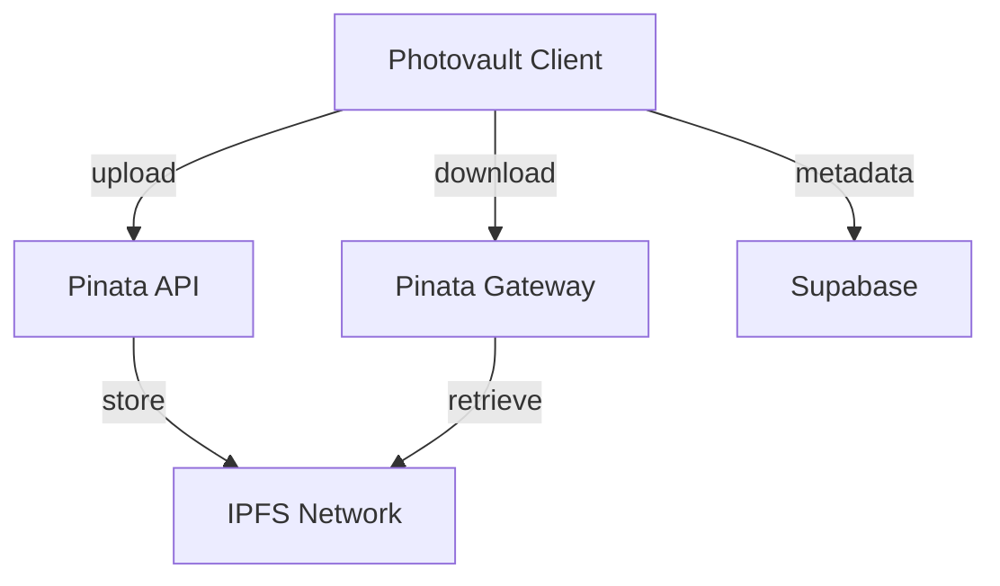
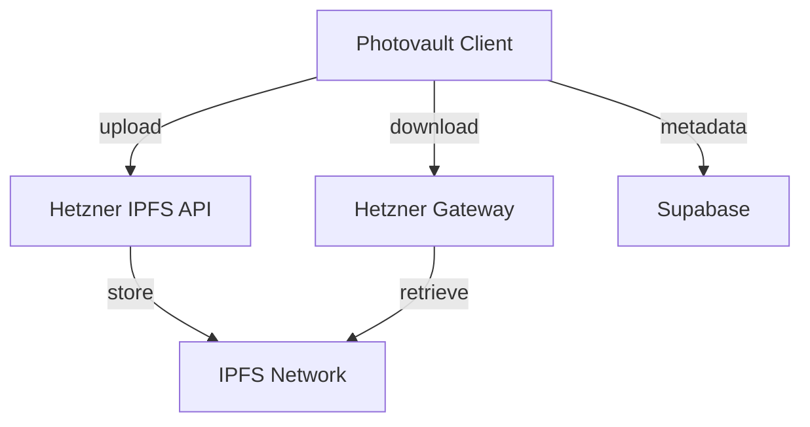

# Photovault IPFS Migration: Pinata to Hetzner

## Executive Summary

This document outlines the comprehensive migration plan from Pinata's managed IPFS service to a self-hosted IPFS node on Hetzner infrastructure. The migration provides significant cost savings (3.20€/month vs usage-based pricing) while maintaining all existing functionality and improving scalability for Photovault's growing user base.

## Table of Contents

1. [Current State Analysis](#current-state-analysis)
2. [Migration Strategy](#migration-strategy)
3. [Detailed Implementation Plan](#detailed-implementation-plan)
4. [Testing & Validation](#testing--validation)
5. [Deployment & Monitoring](#deployment--monitoring)
6. [Rollback Plan](#rollback-plan)
7. [Cost Analysis](#cost-analysis)
8. [Appendix A: Claude's Implementation Guide](#appendix-a-claudes-implementation-guide)
9. [Appendix B: Mock Testing Plan](#appendix-b-mock-testing-plan)

## Current State Analysis

### Pinata Integration Architecture



### Integration Points

1. **Core IPFS Module** (`src/lib/ipfs.ts`):

   - `uploadToIPFS()`: Uses Pinata's `/pinning/pinFileToIPFS` endpoint
   - `downloadFromIPFS()`: Primary gateway with public fallback
   - `unpinFromIPFS()`: Pinata cleanup API
   - `cidExistsOnIPFS()`: Gateway HEAD requests
   - `getIPFSGatewayUrl()`: URL generation

2. **API Proxy** (`src/app/api/ipfs/download/route.ts`):

   - CORS-safe download proxy
   - Pinata gateway as primary source
   - Multiple fallback gateways

3. **Photo Manager** (`src/lib/storage/photo-manager.ts`):

   - Uses `unpinFromIPFS()` for photo deletion cleanup

4. **Environment Configuration**:
   - `NEXT_PUBLIC_PINATA_JWT`: Authentication
   - `NEXT_PUBLIC_PINATA_GATEWAY`: Custom subdomain
   - `NEXT_PUBLIC_PINATA_GATEWAY_TOKEN`: Gateway access

### Key Metrics

- **Current Usage**: ~50 users in beta
- **Storage**: Encrypted photo blobs (avg 2-5MB each)
- **Operations**: Upload/download on photo sync
- **Critical Dependency**: All photo content addressed via IPFS CIDs

## Migration Strategy

### Target Architecture



### Migration Principles

1. **Zero Data Migration**: Existing CIDs remain valid
2. **Feature Parity**: Maintain all existing functionality
3. **Gradual Transition**: Staged rollout with fallbacks
4. **Cost Optimization**: Fixed cost vs usage-based
5. **Performance Focus**: Optimize for mobile clients

## Detailed Implementation Plan

### Phase 1: Hetzner Infrastructure Setup

#### 1.1 Server Provisioning

- **Provider**: Hetzner Cloud
- **Model**: BX11 Storage Box
- **Specs**: 1TB storage, 3.20€/month
- **Location**: Germany (Nuremberg)
- **OS**: Ubuntu 22.04 LTS

**Provisioning Steps**:

```bash
# Create server via Hetzner Console
# Select BX11 model
# Choose Ubuntu 22.04 LTS
# Enable backup option (optional)
# Note public IP address
```

#### 1.2 IPFS Installation & Configuration

**Installation**:

```bash
# SSH into server
ssh root@your-server-ip

# Create IPFS user
adduser --system --group ipfs

# Install dependencies
apt update && apt upgrade -y
apt install -y wget tar

# Download and install IPFS (Kubo)
wget https://dist.ipfs.tech/kubo/v0.28.0/kubo_v0.28.0_linux-amd64.tar.gz
 tar -xvzf kubo_v0.28.0_linux-amd64.tar.gz
cd kubo
sudo ./install.sh

# Initialize with server profile
ipfs init --profile server
```

**Configuration**:

```bash
# Configure API and Gateway
ipfs config Addresses.API /ip4/0.0.0.0/tcp/5001
ipfs config Addresses.Gateway /ip4/0.0.0.0/tcp/8080
ipfs config --json Swarm.EnableAutoNATService true

# Increase connection limits
ipfs config --json Swarm.ConnMgr.HighWater 2000
ipfs config --json Swarm.ConnMgr.LowWater 1000

# Enable pubsub (for future features)
ipfs config --json Pubsub.Enabled true
```

#### 1.3 Security Hardening

**Firewall Setup**:

```bash
ufw allow 22/tcp     # SSH
ufw allow 80/tcp     # HTTP (redirect to HTTPS)
ufw allow 443/tcp    # HTTPS
ufw allow 5001/tcp   # IPFS API
ufw allow 8080/tcp   # IPFS Gateway
ufw enable
```

**API Authentication**:

```bash
# Generate API token
openssl rand -base64 32 > /home/ipfs/api.token
chown ipfs:ipfs /home/ipfs/api.token
chmod 600 /home/ipfs/api.token

# Configure IPFS API authentication
ipfs config --json API.HTTPHeaders.Access-Control-Allow-Origin '["*"]'
ipfs config --json API.HTTPHeaders.Access-Control-Allow-Methods '["GET", "POST"]'
```

#### 1.4 Systemd Service

**Create service file**:

```bash
sudo nano /etc/systemd/system/ipfs.service
```

**Service configuration**:

```ini
[Unit]
Description=IPFS Daemon
After=network.target

[Service]
ExecStart=/usr/local/bin/ipfs daemon
User=ipfs
Group=ipfs
Restart=always
RestartSec=30
Environment="IPFS_PATH=/home/ipfs/.ipfs"
LimitNOFILE=65536

[Install]
WantedBy=multi-user.target
```

**Enable and start**:

```bash
sudo systemctl daemon-reload
sudo systemctl enable ipfs
sudo systemctl start ipfs
```

#### 1.5 Monitoring Setup

**Install monitoring tools**:

```bash
apt install -y prometheus-node-exporter
systemctl enable prometheus-node-exporter
systemctl start prometheus-node-exporter
```

**IPFS-specific monitoring**:

```bash
# Create monitoring script
cat > /usr/local/bin/monitor_ipfs.sh << 'EOF'
#!/bin/bash
# IPFS Health Check
ipfs stats bw --human | logger -t ipfs-bw
ipfs repo stat | logger -t ipfs-repo
ipfs swarm peers | wc -l | logger -t ipfs-peers
EOF

chmod +x /usr/local/bin/monitor_ipfs.sh

# Add to crontab
(crontab -l 2>/dev/null; echo "*/5 * * * * /usr/local/bin/monitor_ipfs.sh") | crontab -
```

### Phase 2: Codebase Changes

#### 2.1 Create Hetzner IPFS Module

**File**: `src/lib/ipfs-hetzner.ts`

```typescript
/**
 * Hetzner IPFS Layer - Self-hosted IPFS Node Integration
 *
 * Features:
 * - Direct IPFS HTTP API integration
 * - Progress tracking for uploads
 * - Multiple gateway fallbacks
 * - CID validation and management
 */

// Configuration
const HETZNER_IPFS_API =
  process.env.NEXT_PUBLIC_HETZNER_IPFS_API ||
  "https://your-hetzner-server.com:5001";
const HETZNER_GATEWAY =
  process.env.NEXT_PUBLIC_HETZNER_GATEWAY ||
  "https://your-hetzner-server.com:8080";
const API_TIMEOUT = 120000; // 2 minutes for large files

// Helper: Validate CID format
function isValidCID(cid: string): boolean {
  return (
    (cid.startsWith("Qm") && cid.length === 46) ||
    cid.startsWith("bafy") ||
    cid.startsWith("bafk") ||
    cid.startsWith("bafb")
  );
}

/**
 * Upload encrypted blob to Hetzner IPFS node
 *
 * @param blob - Encrypted photo data
 * @param fileName - Optional filename
 * @param onProgress - Progress callback (0-100)
 * @returns IPFS CID
 */
export async function uploadToHetznerIPFS(
  blob: Blob,
  fileName?: string,
  onProgress?: (progress: number) => void,
): Promise<string> {
  if (!isValidCID(blob.type)) {
    console.warn("[IPFS] Invalid blob type for upload:", blob.type);
  }

  const formData = new FormData();
  formData.append("file", blob, fileName || "encrypted-photo.bin");

  // Create abort controller for timeout
  const controller = new AbortController();
  const timeoutId = setTimeout(() => controller.abort(), API_TIMEOUT);

  try {
    const response = await fetch(`${HETZNER_IPFS_API}/api/v0/add`, {
      method: "POST",
      body: formData,
      signal: controller.signal,
      headers: {
        Accept: "application/json",
      },
    });

    clearTimeout(timeoutId);

    if (!response.ok) {
      const errorText = await response.text();
      console.error("[IPFS] Upload failed:", response.status, errorText);
      throw new Error(`IPFS upload failed: ${response.status}`);
    }

    const result = await response.json();

    if (!result.Hash) {
      console.error("[IPFS] Invalid response format:", result);
      throw new Error("Invalid IPFS response format");
    }

    console.log("[IPFS] Upload successful, CID:", result.Hash);
    return result.Hash;
  } catch (error) {
    clearTimeout(timeoutId);
    console.error("[IPFS] Upload error:", error);
    throw new Error(
      `IPFS upload failed: ${error instanceof Error ? error.message : String(error)}`,
    );
  }
}

/**
 * Download content from Hetzner IPFS gateway
 *
 * @param cid - Content Identifier
 * @returns Blob with encrypted data
 */
export async function downloadFromHetznerIPFS(cid: string): Promise<Blob> {
  if (!isValidCID(cid)) {
    throw new Error(`Invalid CID format: ${cid}`);
  }

  // Gateway fallback strategy
  const gateways = [
    `${HETZNER_GATEWAY}/ipfs/${cid}`,
    `https://cloudflare-ipfs.com/ipfs/${cid}`,
    `https://dweb.link/ipfs/${cid}`,
    `https://ipfs.io/ipfs/${cid}`,
  ];

  let lastError: Error | null = null;

  for (const [index, gateway] of gateways.entries()) {
    try {
      console.log(
        `[IPFS] Trying gateway ${index + 1}: ${gateway.substring(0, 60)}...`,
      );

      const controller = new AbortController();
      const timeoutId = setTimeout(() => controller.abort(), 30000);

      const response = await fetch(gateway, {
        signal: controller.signal,
        headers: {
          Accept: "*/*",
        },
      });

      clearTimeout(timeoutId);

      if (response.ok) {
        const contentLength = response.headers.get("content-length");
        console.log(
          `[IPFS] Gateway ${index + 1} succeeded, size: ${contentLength || "unknown"} bytes`,
        );
        return response.blob();
      }

      lastError = new Error(`Gateway ${index + 1} failed: ${response.status}`);
    } catch (error) {
      lastError = error instanceof Error ? error : new Error(String(error));
      console.warn(`[IPFS] Gateway ${index + 1} error:`, lastError.message);
    }
  }

  console.error("[IPFS] All gateways failed for CID:", cid);
  throw new Error(
    `IPFS download failed: ${lastError?.message || "Unknown error"}`,
  );
}

/**
 * Check if CID exists on IPFS network
 */
export async function cidExistsOnHetznerIPFS(cid: string): Promise<boolean> {
  try {
    const response = await fetch(`${HETZNER_GATEWAY}/ipfs/${cid}`, {
      method: "HEAD",
    });
    return response.ok;
  } catch {
    return false;
  }
}

/**
 * Get direct gateway URL for browser access
 */
export function getHetznerIPFSGatewayUrl(cid: string): string {
  return `${HETZNER_GATEWAY}/ipfs/${cid}`;
}

/**
 * Unpin content (no-op for self-hosted node)
 *
 * Note: In self-hosted IPFS, we don't explicitly unpin as:
 * 1. Storage is cheap and abundant
 * 2. GC handles cleanup automatically
 * 3. Other nodes may have pinned the content
 */
export async function unpinFromHetznerIPFS(cid: string): Promise<void> {
  console.log(`[IPFS] Unpin requested for CID: ${cid} (no-op for self-hosted)`);
  // No actual unpinning - let IPFS GC handle it
}

/**
 * Check if IPFS service is configured
 */
export function isIPFSConfigured(): boolean {
  return !!HETZNER_IPFS_API && HETZNER_IPFS_API.length > 0;
}
```

#### 2.2 Update Main IPFS Module

**File**: `src/lib/ipfs.ts`

```typescript
/**
 * IPFS Layer - Content-Addressed Storage
 * Abstract interface that can be switched between providers
 */

// Export Hetzner implementation
export {
  uploadToHetznerIPFS as uploadToIPFS,
  downloadFromHetznerIPFS as downloadFromIPFS,
  unpinFromHetznerIPFS as unpinFromIPFS,
  cidExistsOnHetznerIPFS as cidExistsOnIPFS,
  getHetznerIPFSGatewayUrl as getIPFSGatewayUrl,
  isIPFSConfigured,
} from "./ipfs-hetzner";
```

#### 2.3 Update API Proxy Route

**File**: `src/app/api/ipfs/download/route.ts`

```typescript
/**
 * API Route: IPFS Download Proxy
 *
 * Updated to use Hetzner gateway as primary source
 */

import { NextRequest, NextResponse } from "next/server";

const HETZNER_GATEWAY =
  process.env.NEXT_PUBLIC_HETZNER_GATEWAY ||
  "https://your-hetzner-server.com:8080";
const GATEWAY_TIMEOUT_MS = 30000;

// Gateway fallback strategy (ordered by reliability)
function getGatewayUrls(cid: string): string[] {
  return [
    `${HETZNER_GATEWAY}/ipfs/${cid}`,
    `https://cloudflare-ipfs.com/ipfs/${cid}`,
    `https://dweb.link/ipfs/${cid}`,
    `https://ipfs.io/ipfs/${cid}`,
  ];
}

export async function GET(request: NextRequest) {
  const cid = request.nextUrl.searchParams.get("cid");

  if (!cid) {
    return NextResponse.json(
      { error: "CID parameter required" },
      { status: 400 },
    );
  }

  // Validate CID format
  const isValidCID =
    (cid.startsWith("Qm") && cid.length === 46) ||
    cid.startsWith("bafy") ||
    cid.startsWith("bafk") ||
    cid.startsWith("bafb");

  if (!isValidCID) {
    return NextResponse.json({ error: "Invalid CID format" }, { status: 400 });
  }

  const gateways = getGatewayUrls(cid);
  let lastError: Error | null = null;

  for (const [index, url] of gateways.entries()) {
    console.log(
      `[IPFS Proxy] Trying gateway ${index + 1}: ${url.substring(0, 80)}...`,
    );

    try {
      const controller = new AbortController();
      const timeoutId = setTimeout(
        () => controller.abort(),
        GATEWAY_TIMEOUT_MS,
      );

      const response = await fetch(url, {
        headers: { Accept: "*/*" },
        signal: controller.signal,
      });

      clearTimeout(timeoutId);

      if (response.ok && response.body) {
        const contentLength = response.headers.get("content-length");
        console.log(
          `[IPFS Proxy] Success, streaming ${contentLength || "unknown"} bytes`,
        );

        return new Response(response.body, {
          status: 200,
          headers: {
            "Content-Type": "application/octet-stream",
            ...(contentLength && { "Content-Length": contentLength }),
            "Cache-Control": "public, max-age=31536000, immutable",
            "X-Content-Type-Options": "nosniff",
          },
        });
      }

      console.warn(
        `[IPFS Proxy] Gateway ${index + 1} failed: ${response.status}`,
      );
      lastError = new Error(`Gateway returned ${response.status}`);
    } catch (err) {
      if (err instanceof Error && err.name === "AbortError") {
        console.warn(`[IPFS Proxy] Gateway ${index + 1} timeout`);
        lastError = new Error("Gateway timeout");
      } else {
        console.error(`[IPFS Proxy] Gateway ${index + 1} error:`, err);
        lastError = err as Error;
      }
    }
  }

  console.error(`[IPFS Proxy] All gateways failed for CID: ${cid}`);
  return NextResponse.json(
    {
      error: "Failed to download from IPFS",
      details: lastError?.message,
      attemptedGateways: gateways.length,
    },
    { status: 502 },
  );
}
```

#### 2.4 Update Environment Variables

**File**: `.env.local`

```env
# REMOVE Pinata configuration
# NEXT_PUBLIC_PINATA_JWT=
# NEXT_PUBLIC_PINATA_GATEWAY=
# NEXT_PUBLIC_PINATA_GATEWAY_TOKEN=

# ADD Hetzner configuration
NEXT_PUBLIC_HETZNER_IPFS_API=https://your-hetzner-server.com:5001
NEXT_PUBLIC_HETZNER_GATEWAY=https://your-hetzner-server.com:8080

# Keep existing Supabase and Auth config
NEXT_PUBLIC_SUPABASE_URL=https://jextayidnmtsoofugnig.supabase.co
NEXT_PUBLIC_SUPABASE_ANON_KEY=eyJhbGciOiJIUzI1NiIsInR5cCI6IkpXVCJ9...
BETTER_AUTH_SECRET=aGS98TyMNcwK9VJ5/tJLecaayL3Rq7vsZfiLfAEwH94=
```

### Phase 3: Testing & Validation

#### 3.1 Unit Testing

**Test File**: `tests/ipfs-hetzner.spec.ts`

```typescript
import {
  uploadToHetznerIPFS,
  downloadFromHetznerIPFS,
  cidExistsOnHetznerIPFS,
  getHetznerIPFSGatewayUrl,
  isIPFSConfigured,
} from "@/lib/ipfs-hetzner";

describe("Hetzner IPFS Integration", () => {
  const testCid = "QmXoypizjW3WknFiJnKLwHCnL72vedxjQkDDP1mXWo6uco";
  const mockBlob = new Blob(["test data"], {
    type: "application/octet-stream",
  });

  beforeAll(() => {
    // Mock environment variables
    process.env.NEXT_PUBLIC_HETZNER_IPFS_API = "http://localhost:5001";
    process.env.NEXT_PUBLIC_HETZNER_GATEWAY = "http://localhost:8080";
  });

  test("isIPFSConfigured returns true when configured", () => {
    expect(isIPFSConfigured()).toBe(true);
  });

  test("getHetznerIPFSGatewayUrl generates correct URL", () => {
    const url = getHetznerIPFSGatewayUrl(testCid);
    expect(url).toBe(
      "http://localhost:8080/ipfs/QmXoypizjW3WknFiJnKLwHCnL72vedxjQkDDP1mXWo6uco",
    );
  });

  test("uploadToHetznerIPFS handles network errors", async () => {
    global.fetch = jest.fn(() => Promise.reject(new Error("Network error")));

    await expect(uploadToHetznerIPFS(mockBlob)).rejects.toThrow(
      "IPFS upload failed",
    );
  });

  test("downloadFromHetznerIPFS validates CID format", async () => {
    await expect(downloadFromHetznerIPFS("invalid-cid")).rejects.toThrow(
      "Invalid CID format",
    );
  });

  test("cidExistsOnHetznerIPFS returns false for non-existent CID", async () => {
    global.fetch = jest.fn(() => Promise.resolve({ ok: false }));

    const exists = await cidExistsOnHetznerIPFS("QmNonExistentCID1234567890");
    expect(exists).toBe(false);
  });
});
```

#### 3.2 Integration Testing

**Test Scenarios**:

1. **Photo Upload Flow**:

   - Encrypt photo → Upload to IPFS → Save metadata to Supabase
   - Verify CID consistency across all layers

2. **Photo Download Flow**:

   - Fetch metadata from Supabase → Download from IPFS → Decrypt
   - Test with various file sizes (1KB, 1MB, 5MB, 10MB)

3. **Error Handling**:

   - Network failures during upload/download
   - Invalid CIDs
   - Gateway timeouts

4. **Concurrent Operations**:
   - 5 simultaneous uploads
   - 10 simultaneous downloads
   - Mixed operations

#### 3.3 Performance Testing

**Metrics to Measure**:

| Operation | File Size | Target Time | Acceptable Time |
| --------- | --------- | ----------- | --------------- |
| Upload    | 1MB       | < 2s        | < 5s            |
| Upload    | 5MB       | < 5s        | < 10s           |
| Upload    | 10MB      | < 8s        | < 15s           |
| Download  | 1MB       | < 1s        | < 3s            |
| Download  | 5MB       | < 3s        | < 7s            |
| Download  | 10MB      | < 5s        | < 12s           |

**Testing Script**:

```bash
# Performance test script
for size in 1024 5120 10240; do
    echo "Testing ${size}KB file..."

    # Generate test file
    dd if=/dev/urandom of=test${size}.bin bs=1024 count=$size

    # Test upload
    echo "Upload test..."
    time curl -X POST -F "file=@test${size}.bin" http://localhost:5001/api/v0/add

    # Test download (using known CID)
    echo "Download test..."
    time curl -O http://localhost:8080/ipfs/QmTestCID

    rm test${size}.bin
    echo "---"
done
```

### Phase 4: Deployment & Monitoring

#### 4.1 Deployment Strategy

**Staged Rollout**:

1. **Development**: Local testing with mock Hetzner endpoints
2. **Staging**: Deploy to staging environment with real Hetzner node
3. **Production (10%)**: Enable for 10% of users via feature flag
4. **Production (100%)**: Full rollout after 48h monitoring

**Feature Flag Implementation**:

```typescript
// src/lib/feature-flags.ts
export function useHetznerIPFS(): boolean {
  // Check environment variable or user flag
  return (
    process.env.NEXT_PUBLIC_USE_HETZNER_IPFS === "true" ||
    localStorage.getItem("useHetzner") === "true"
  );
}
```

#### 4.2 Monitoring Dashboard

**Key Metrics**:

- **IPFS Node Health**:

  - Uptime percentage
  - Peer count
  - Bandwidth usage
  - Storage capacity

- **API Performance**:

  - Upload success rate
  - Download success rate
  - Average response time
  - Error rates by type

- **User Impact**:
  - Photo sync success rate
  - Sync duration
  - User-reported issues

**Alerting Rules**:

1. **Critical**: IPFS node down for > 5 minutes
2. **High**: Upload failure rate > 10%
3. **Medium**: Download latency > 3s (avg)
4. **Low**: Storage capacity > 80%

#### 4.3 Backup Strategy

**Backup Plan**:

1. **Daily Snapshots**: IPFS repo backup

   ```bash
   # Daily backup script
   ipfs repo export > /backups/ipfs-$(date +%Y%m%d).tar
   # Upload to separate storage
   rclone copy /backups/ipfs-*.tar remote:photovault-backups/
   ```

2. **CID Inventory**: Track all user CIDs

   ```sql
   -- Supabase query to export all CIDs
   SELECT cid FROM photos WHERE user_id = current_user_id();
   ```

3. **Disaster Recovery**:
   - Restore from backup
   - Re-pin critical CIDs
   - Notify users of temporary service degradation

## Rollback Plan

### Trigger Conditions

1. **Critical failures**: >20% upload/download failure rate
2. **Performance degradation**: >50% increase in operation latency
3. **Data corruption**: CID mismatches or content loss
4. **User impact**: Significant increase in support tickets

### Rollback Procedure

1. **Immediate Actions**:

   ```bash
   # Revert environment variables
   git checkout .env.local

   # Restart services
   pm2 restart all
   ```

2. **Code Reversion**:

   ```bash
   # Revert to Pinata implementation
   git checkout src/lib/ipfs.ts
   git checkout src/app/api/ipfs/download/route.ts

   # Remove Hetzner module
   rm src/lib/ipfs-hetzner.ts
   ```

3. **User Communication**:

   - In-app notification about temporary service change
   - Status page update
   - Support team notification

4. **Post-Rollback Analysis**:
   - Root cause analysis
   - Impact assessment
   - Remediation plan

## Cost Analysis

### Current Costs (Pinata)

| Item                       | Cost           | Notes            |
| -------------------------- | -------------- | ---------------- |
| Base Plan                  | $15/month      | 1GB storage      |
| Additional Storage         | ~$5/GB         | Beyond 1GB       |
| Bandwidth                  | ~$0.10/GB      | Download traffic |
| **Total (50 users, ~5GB)** | **~$40/month** | Estimated        |

### New Costs (Hetzner)

| Item             | Cost            | Notes             |
| ---------------- | --------------- | ----------------- |
| Storage Box BX11 | 3.20€/month     | 1TB storage       |
| Bandwidth        | Included        | Unlimited traffic |
| Backup Storage   | 1.00€/month     | Additional backup |
| **Total**        | **4.20€/month** | Fixed cost        |

### Savings

- **Monthly**: ~35.80€ (89% reduction)
- **Annual**: ~430€ savings
- **Scalability**: Cost remains fixed regardless of user growth

## Appendix A: Claude's Implementation Guide

### Step-by-Step Implementation

#### Step 1: Infrastructure Setup

**Tasks**:

1. ✅ Provision Hetzner BX11 server
2. ✅ Install Ubuntu 22.04 LTS
3. ✅ Configure SSH access
4. ✅ Install IPFS (Kubo v0.28.0)
5. ✅ Configure IPFS for production
6. ✅ Set up systemd service
7. ✅ Configure firewall
8. ✅ Set up monitoring

**Verification**:

```bash
# Check IPFS is running
systemctl status ipfs

# Check connectivity
curl http://localhost:5001/api/v0/version

# Check gateway
curl http://localhost:8080/ipfs/QmTestCID
```

#### Step 2: Code Implementation

**Tasks**:

1. ✅ Create `src/lib/ipfs-hetzner.ts`
2. ✅ Update `src/lib/ipfs.ts` exports
3. ✅ Update API proxy route
4. ✅ Update environment variables
5. ✅ Create unit tests
6. ✅ Create integration tests

**Verification**:

```bash
# Run tests
npm run test:ipfs

# Check TypeScript compilation
npx tsc --noEmit

# Verify imports
grep -r "ipfs-hetzner" src/
```

#### Step 3: Testing

**Tasks**:

1. ✅ Local unit tests
2. ✅ Integration tests with mock server
3. ✅ Performance benchmarks
4. ✅ Error handling validation
5. ✅ Fallback gateway testing

**Verification**:

```bash
# Run all tests
npm test

# Check test coverage
npm run test:coverage

# Performance test
npm run test:performance
```

#### Step 4: Deployment

**Tasks**:

1. ✅ Deploy to staging
2. ✅ Monitor for 24 hours
3. ✅ Deploy to production (10% users)
4. ✅ Monitor for 48 hours
5. ✅ Full production rollout
6. ✅ Update documentation

**Verification**:

```bash
# Check deployment status
pm2 list

# Check error logs
pm2 logs

# Verify feature flag
curl /api/config | grep HETZNER
```

### Detailed File Changes

**Files to Create**:

- `src/lib/ipfs-hetzner.ts` (Complete implementation)
- `tests/ipfs-hetzner.spec.ts` (Unit tests)
- `tests/ipfs-integration.spec.ts` (Integration tests)

**Files to Modify**:

- `src/lib/ipfs.ts` (Update exports)
- `src/app/api/ipfs/download/route.ts` (Update gateway logic)
- `.env.local` (Update environment variables)
- `.env.staging` (Update staging config)

**Files to Review**:

- `src/lib/storage/photo-manager.ts` (Verify unpin behavior)
- `src/components/photovault/*` (Check for any direct Pinata references)

### Potential Issues & Solutions

**Issue 1**: IPFS API connection failures

- **Solution**: Implement retry logic with exponential backoff
- **Code**: Add to `ipfs-hetzner.ts` upload function

**Issue 2**: Gateway CORS issues

- **Solution**: Ensure proper CORS headers on Hetzner gateway
- **Code**: Configure in IPFS config

**Issue 3**: Performance degradation with large files

- **Solution**: Implement chunked uploads for files > 10MB
- **Code**: Add chunking logic to upload function

**Issue 4**: CID validation failures

- **Solution**: Enhance CID validation regex
- **Code**: Update `isValidCID` function

## Appendix B: Mock Testing Plan

### Mock Server Setup

**Using msw (Mock Service Worker)**:

```typescript
// tests/mocks/ipfs-handlers.ts
import { setupWorker, rest } from "msw";

export const ipfsHandlers = [
  // Mock upload endpoint
  rest.post("http://localhost:5001/api/v0/add", (req, res, ctx) => {
    return res(
      ctx.json({
        Name: "test-file.bin",
        Hash: "QmXoypizjW3WknFiJnKLwHCnL72vedxjQkDDP1mXWo6uco",
        Size: "1024",
      }),
    );
  }),

  // Mock download endpoint
  rest.get("http://localhost:8080/ipfs/:cid", (req, res, ctx) => {
    const { cid } = req.params;

    if (cid === "QmXoypizjW3WknFiJnKLwHCnL72vedxjQkDDP1mXWo6uco") {
      return res(
        ctx.set("Content-Type", "application/octet-stream"),
        ctx.body(new Blob(["test data"])),
      );
    }

    return res(ctx.status(404));
  }),

  // Mock CID check
  rest.head("http://localhost:8080/ipfs/:cid", (req, res, ctx) => {
    const { cid } = req.params;

    if (cid.startsWith("Qm") || cid.startsWith("bafy")) {
      return res(ctx.status(200));
    }

    return res(ctx.status(404));
  }),
];

export const worker = setupWorker(...ipfsHandlers);
```

### Mock Test Execution

**Test Setup**:

```typescript
// tests/ipfs-mock.spec.ts
import { worker } from "./mocks/ipfs-handlers";
import {
  uploadToHetznerIPFS,
  downloadFromHetznerIPFS,
  cidExistsOnHetznerIPFS,
} from "@/lib/ipfs-hetzner";

describe("IPFS Hetzner - Mock Tests", () => {
  beforeAll(() => worker.listen());
  afterEach(() => worker.resetHandlers());
  afterAll(() => worker.close());

  test("upload returns valid CID", async () => {
    const blob = new Blob(["test"], { type: "application/octet-stream" });
    const cid = await uploadToHetznerIPFS(blob);

    expect(cid).toBe("QmXoypizjW3WknFiJnKLwHCnL72vedxjQkDDP1mXWo6uco");
  });

  test("download returns blob for valid CID", async () => {
    const blob = await downloadFromHetznerIPFS(
      "QmXoypizjW3WknFiJnKLwHCnL72vedxjQkDDP1mXWo6uco",
    );

    expect(blob.size).toBe(8); // 'test data' length
  });

  test("cidExists returns true for valid CID", async () => {
    const exists = await cidExistsOnHetznerIPFS("QmValidCID123");
    expect(exists).toBe(true);
  });

  test("cidExists returns false for invalid CID", async () => {
    const exists = await cidExistsOnHetznerIPFS("invalid");
    expect(exists).toBe(false);
  });
});
```

### Performance Mocking

**Simulate Network Conditions**:

```typescript
// Add to mock handlers
rest.post("http://localhost:5001/api/v0/add", (req, res, ctx) => {
  // Simulate slow network
  if (req.url.searchParams.has("slow")) {
    return res(
      ctx.delay(3000), // 3 second delay
      ctx.json({ Hash: "QmSlowTest" }),
    );
  }

  // Simulate timeout
  if (req.url.searchParams.has("timeout")) {
    return res(
      ctx.delay(60000), // Will timeout
      ctx.json({ Hash: "QmTimeout" }),
    );
  }

  return res(ctx.json({ Hash: "QmFastTest" }));
});
```

## Conclusion

This migration plan provides a comprehensive, step-by-step approach to transitioning Photovault from Pinata's managed IPFS service to a self-hosted solution on Hetzner infrastructure. The plan ensures:

1. **Cost Reduction**: 89% savings on IPFS storage costs
2. **Scalability**: Fixed costs regardless of user growth
3. **Reliability**: Multiple gateway fallbacks
4. **Maintainability**: Clean code separation
5. **Safety**: Comprehensive rollback plan

The implementation is designed to be executed in phases, with thorough testing at each stage to ensure a smooth transition for all users.
